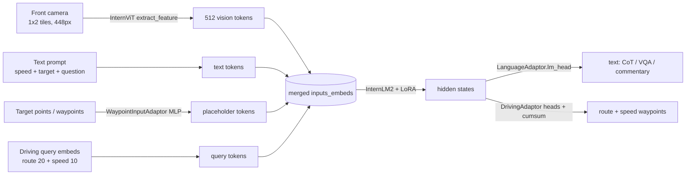

# SimLingo — Architecture Overview

SimLingo is a **camera-only Vision-Language-Action (VLA) model** for closed-loop
autonomous driving in CARLA. A single InternVL2 transformer jointly consumes
front-camera image tokens, a text prompt, and learnable "driving" query tokens,
and produces two kinds of output:

- **Action** — future *route waypoints* and *speed waypoints* (the trajectory), and
- **Language** — chain-of-thought commentary, VQA answers, and instruction-following
  text.

The headline idea of the paper is **Action Dreaming**: the same image is paired with
many different natural-language instructions, each mapped to a different future
trajectory, which forces tight *language ↔ action alignment* (the model must drive
differently based purely on the words, and refuse unsafe instructions).

> CVPR'25 Highlight — *SimLingo: Vision-Only Closed-Loop Autonomous Driving with
> Language-Action Alignment* (Renz et al.). Built on top of
> [CARLA garage](https://github.com/autonomousvision/carla_garage); the expert is
> PDM-Lite from DriveLM.

---

## 1. The two model variants

| | **SimLingo (full)** | **SimLingo-Base (CarLLaVA)** |
|---|---|---|
| Folder | `simlingo_training/` | `simlingo_base_training/` |
| Vision encoder | InternVL2 (InternViT) | LLaVA-Next **or** ResNet-34 |
| LLM backbone | InternLM2 (from InternVL2-1B), LoRA | small **Llama from scratch** (default `x-small`, 235M) |
| Tasks | waypoints **+** language (VQA / commentary / dreaming) | **waypoints only** |
| Driving loss | smooth-L1 | MSE |
| Adaptors | `DrivingAdaptor` + `LanguageAdaptor` | `DrivingAdaptor` only (+ `VectorInputAdaptor` for speed) |
| Inference output | `(speed_wps, route, language)` | `(speed_wps, route)` |

The base model is the **ablation baseline** (previously "CarLLaVA"): pure trajectory
regression, no language. The rest of this document describes the **full SimLingo**
unless stated otherwise.

---

## 2. Repository layout

| Path | Role |
|---|---|
| `simlingo_training/` | Full VLA model: training, model, dataloaders, language eval |
| `simlingo_base_training/` | Vision-only base model (CarLLaVA) |
| `team_code/` | CARLA agents — `agent_simlingo.py` (closed-loop inference), `autopilot.py`/`data_agent.py` (PDM-Lite expert for data collection), controllers & planners |
| `dataset_generation/` | Driving-data collection, VQA/commentary/dreamer label generation |
| `leaderboard_autopilot/`, `scenario_runner_autopilot/` | Modified CARLA leaderboard used by the expert during data collection |
| `Bench2Drive/` | Closed-loop benchmark (220 routes) |
| `leaderboard/`, `scenario_runner/` | Route files / optional eval on CARLA routes |
| `data/` | Route files and augmented language templates |

### Core training subtree (`simlingo_training/`)

```
models/
  encoder/internvl2_model.py   InternVL2 wrapper: extract_feature + placeholder splicing
  encoder/vlm.py               VLMEncoderModel (freeze logic, drops bundled LM)
  language_model/llm.py        LLM wrapper around InternLM2 (inputs_embeds, greedy_sample)
  adaptors/adaptors.py         DrivingAdaptor / LanguageAdaptor / WaypointInputAdaptor / AdaptorList
  driving.py                   DrivingModel (LightningModule) — assembles everything
  utils.py                     summarise_losses
dataloader/
  dataset_base.py              BaseDataset — indexing & raw loaders (largest file)
  dataset_driving.py           Data_Driving — waypoint task __getitem__
  dataset_dreamer.py           Data_Dreamer — Action Dreaming samples
  dataset_eval_qa_comm.py      Data_Eval — VQA / commentary eval samples
  dataset_eval_dreamer.py      Eval_Dreamer — dreaming eval samples
  datamodule.py                DataModule + dl_collate_fn (image tiling, tokenization, batching)
utils/
  custom_types.py              DrivingInput / Example / Label / Output, LanguageLabel, DatasetOutput
  internvl2_utils.py           image tiling, chat template, loss mask
config.py / config/            Hydra structured config + yaml experiments
callbacks/visualise.py         GT-vs-pred trajectory plotting to wandb
train.py / eval.py / eval_metrics.py   training & language-eval entry points
```

---

## 3. The VLA forward idea

Everything the LLM sees is a **single embedding sequence** (`inputs_embeds`), never
token ids — because the sequence mixes four heterogeneous modalities:

```
[ text-token embeddings | <IMG_CONTEXT> vision embeddings | waypoint/target placeholder embeddings | driving query tokens ]
```

- **Text** is embedded by `LanguageAdaptor.embed_tokens`.
- **Image** patches are turned into embeddings by InternViT (`extract_feature`) and
  spliced into the `<IMG_CONTEXT>` placeholder slots
  (`internvl2_model.py:replace_placeholder_tokens`).
- **Numeric inputs** (target points / input waypoints) are MLP-encoded by
  `WaypointInputAdaptor` and spliced into their placeholder slots.
- **Driving queries** are learnable parameters (`DrivingAdaptor`) appended at the end;
  the LLM hidden states at those positions are decoded by regression heads into the
  trajectory.

The trajectory heads predict **per-step displacements** that are turned into absolute
coordinates with `.cumsum(1)` (`adaptors.py`); the loss is computed on the cumulative
result.



---

## 4. The two pipelines

### Training (teacher-forced, multi-task)

`train.py` → Hydra builds the `DataModule` and `DrivingModel` → PyTorch Lightning
`Trainer` (DeepSpeed ZeRO-2, `16-mixed`) → `trainer.fit`.

Each step (`DrivingModel.training_step` → `forward_loss` → `forward_model`) runs **one**
teacher-forced forward pass over `[prompt + answer + driving queries]`, then
`AdaptorList.compute_loss` produces per-task losses (language cross-entropy + driving
smooth-L1) which `summarise_losses` averages-then-sums into the total loss.

The vision backbone is largely **frozen** (only the `mlp1` projector trains), the LLM is
adapted with **LoRA**, and the adaptors / heads / `wp_encoder` train fully — hence the
relatively high base LR.

### Inference (closed-loop in CARLA)

`team_code/agent_simlingo.py::LingoAgent` runs inside the CARLA Leaderboard:
sensors → image preprocessing → **UKF localization (no SLAM)** → route/target point from
the privileged `GlobalRoutePlanner` → prompt → `DrivingModel.forward` → predicted
waypoints + language → **lateral PID** (steer) + **longitudinal controller** (throttle/
brake) → `carla.VehicleControl`.

Inference `forward` is **autoregressive and per-batch-item**: it greedy-samples the
language, then appends the driving query tokens and does a second pass to regress the
trajectory. See `model_inference_flow.md` for the full trace.

---

## 5. Core data structures (`simlingo_training/utils/custom_types.py`)

All are `NamedTuple`s; they define the contract between dataloader, model, and agent.

| Type | Meaning (key fields) |
|---|---|
| `DatasetOutput` | one raw dataset record — `conversation`, `answer`, `image_ff`, `waypoints`, `path`, `target_points`, `speed`, `placeholder_values`, `qa_templates`, `eval_infos` |
| `LanguageLabel` | tokenized prompt/answer — `phrase_ids [B,T]`, `phrase_valid`, `phrase_mask`/`loss_masking`, `placeholder_values`, `language_string` |
| `DrivingInput` | model input — `camera_images [B,T,N,C,448,448]`, intrinsics/extrinsics, `vehicle_speed`, `target_point`, `prompt`, `prompt_inference` |
| `DrivingLabel` | supervision — `waypoints [B,F,2]`, `path [B,20,2]`, `answer`, `eval_infos` |
| `DrivingExample` | top-level batch — `driving_input`, `driving_label`, `run_id`, `qa_templates` |
| `DrivingOutput` / `TrainingOutput` | model output type / loss bundle (`loss`, `loss_averages`, `loss_counts`) |

> Gotcha: `DrivingInput.camera_images` is annotated `uint8 [0,255]` but is actually
> ImageNet-normalized float after the collate transform — trust the code, not the comment.

---

## 6. Tech stack

- **PyTorch Lightning** — training loop, callbacks, distributed.
- **Hydra** — structured config (`config.py` dataclasses + `ConfigStore`) composed with
  `config/experiment/*.yaml`; `_recursive_=False` so modules instantiate their own children.
- **DeepSpeed ZeRO-2** — optimizer/gradient sharding across 8 GPUs, static fp16 loss scale.
- **InternVL2-1B** (`transformers`, `trust_remote_code=True`) — InternViT vision tower +
  InternLM2 language model; SimLingo keeps the vision tower + `mlp1` projector and wraps the
  language model separately.
- **PEFT LoRA** — `r=32, alpha=64` on the LLM.
- **wandb** — logging + trajectory-visualization images.

---

## 7. Where to read next

- `core_components.md` — per-module reference (classes, functions, file:line).
- `model_inference_flow.md` — end-to-end closed-loop trace and control math.
