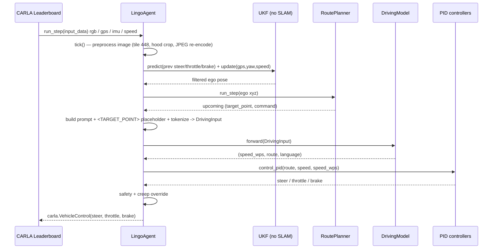

# SimLingo — Model Inference Flow

How a single closed-loop step works at deployment time in CARLA, from raw sensors to
`carla.VehicleControl`. The entry point is
`team_code/agent_simlingo.py::LingoAgent.run_step` (`agent_simlingo.py:762`). For module
details see `core_components.md`.

---

## 1. The closed-loop step at a glance



---

## 2. Stage-by-stage trace

### (a) Sensors → raw data
`sensors()` (`agent_simlingo.py:354`) requests RGB camera(s) + IMU + GNSS + speedometer.
Camera 0 is mounted at `[-1.5, 0.0, 2.0]`, `fov=110` (`config_simlingo.py:55-60`).

### (b) Image preprocessing — `tick` (`agent_simlingo.py:453-502`)
1. BGR→RGB, then **re-encode/decode as JPEG** to replicate training compression artifacts
   (`:465-466`) — a deliberate train/inference distribution-matching trick.
2. Crop the bottom hood region: `rgb[:int(H - (H*4.8)//16)]` (`:469`).
3. InternVL2 `dynamic_preprocess` into 448×448 tiles (`max_num=2`) + `build_transform`
   normalization (`:483-502`). Output `[1, T=1, num_patches, 3, 448, 448]`.

This mirrors `datamodule.dl_collate_fn` exactly — keep the two in sync.

### (c) Localization without SLAM — UKF (`tick`, `agent_simlingo.py:507-527`)
- `gps_pos = route_planner.convert_gps_to_carla(gps)` — Mercator GPS→CARLA
  (`nav_planner.py:201`).
- `compass = t_u.preprocess_compass(imu)` — normalize, subtract 90° into CARLA frame.
- **UKF** (`filterpy`, Merwe sigma points):
  `ukf.predict(steer, throttle, brake)` propagates state with the kinematic bicycle model
  (`bicycle_model_forward`, `:1024`) using the *previous* control; `ukf.update([x, y, yaw,
  speed])` fuses the GPS/IMU/speed measurement. The filtered `[x,y]` is the ego position.

The lat/lon reference is recovered numerically with `fsolve` because the leaderboard hides
GPS refs (`_init`, `:330-347`).

### (d) Route & target point (`tick`, `agent_simlingo.py:533-623`)
- `waypoint_route = route_planner.run_step([x,y,z])` → upcoming `(pos, RoadOption)` pairs.
- `target_point` = node `[1]`, `next_target_point` = node `[2]`.
- Transform to ego frame: `ego_target_point = t_u.inverse_conversion_2d(target_point, gps,
  compass)` (`:557`) — rotate by `R(yaw)ᵀ`, translate; x forward, y lateral.
- Default conditioning `eval_route_as='target_point'` (`config_simlingo.py:7`): set
  `placeholder_values = {'<TARGET_POINT>': target_points}` and
  `prompt_tp = "Target waypoint: <TARGET_POINT><TARGET_POINT>."` (`:566-580`).

### (e) Prompt + tokenization (`tick`, `agent_simlingo.py:628-758`)
- Prompt: `f"Current speed: {speed} m/s. {prompt_tp} What should the ego do next?"` (CoT) or
  `"... Predict the waypoints."` (`:629-631`).
- Wrap in the `internlm2-chat` template; `<image>` → `` + `<IMG_CONTEXT>·512` +
  `</img>` (`:732-733`).
- Tokenize → `LanguageLabel`; assemble `self.DrivingInput` (bf16 camera images, intrinsics
  from `get_camera_intrinsics(W,H,110)`, extrinsics, speed, target points, prompt)
  (`:751-758`).

### (f) Model forward (`run_step`, `agent_simlingo.py:796-799`)
```python
model_input = DrivingInput(**self.DrivingInput)
pred_speed_wps, pred_route, language = self.model(model_input)
```

Inside `DrivingModel.forward` (`driving.py:104`):

1. `self.adaptors(example, inference=True)` builds the token streams from
   `prompt_inference`.
2. `replace_placeholder_tokens(...)` splices the InternViT image embeddings into the
   `<IMG_CONTEXT>` slots and the MLP-encoded target points into their placeholder slots
   (`driving.py:120-125`).
3. **Per batch item** (loop at `:133`, because padding prevents clean batching): pick the
   variant-specific EOS (`:136-141`) and `greedy_sample` up to 100 language tokens
   (`:144-152`).
4. Append the **driving query tokens** to the generated language embeddings and run a
   second `language_model.forward` (`:154-156`); the trailing `len_driving` hidden states
   feed `DrivingAdaptor.get_predictions` → heads → `.cumsum(1)` → `route [20,2]`,
   `speed_wps [10,2]` (`:158-162`).
5. Returns `(speed_wps, route, language)`.

> Inference is autoregressive and per-item, so it is **slower than training** (which is a
> single teacher-forced pass). This is the main latency cost of the language head.

### (g) Waypoints → control — `control_pid` (`agent_simlingo.py:915-962`)

**Longitudinal** (target speed from the *spacing* of speed waypoints, not a regressed
scalar):
```python
one_second = carla_fps // (wp_dilation * data_save_freq)   # 20 // (1*5) = 4
half_second = one_second // 2                              # 2
desired_speed = ||speed_wps[half_second-2] - speed_wps[one_second-2]|| * 2.0   # ||wp0 - wp2|| * 2
brake = (desired_speed < brake_speed) or (speed / desired_speed > brake_ratio)
delta = clip(desired_speed - speed, 0, clip_delta)
throttle = speed_controller.step(delta)     # t_u.PIDController k_p=1.75 k_i=1.0 k_d=2.0
```
Closer speed waypoints ⇒ lower target speed ⇒ less throttle / brake.

**Lateral** (heading-error PID on the ego-frame route):
```python
route_interp = interpolate_waypoints(route)   # PCHIP resample to 0.1 m, origin prepended
steer = turn_controller.step(route_interp, speed)   # nav_planner.LateralPIDController
```
The PID picks a speed-adaptive lookahead point and computes
`heading_error = atan2(y, x)` of that point (the vehicle sits at the origin facing +x), then
`steer = clip(k_p·e + k_d·Δe + k_i·∑e, -1, 1)` (`nav_planner.py:120-136`).

### (h) Safety & dispatch (`run_step`, `agent_simlingo.py:881-913`)
- **Stuck recovery**: if `speed < 0.1` for `> stuck_threshold (800)` frames, force creep
  (`throttle ≥ 0.4`, `brake=False`) for `creep_duration (15)` frames.
- **Startup brake**: the first `inital_frames_delay (40)` frames are forced to full brake so
  the spawn-freeze doesn't poison the UKF.
- Emit `carla.VehicleControl(steer, throttle, brake)`.

---

## 3. Control math summary

| Quantity | Formula | Source |
|---|---|---|
| Lateral steer | `clip(k_p·e + k_d·Δe + k_i·mean(window), -1, 1)`, `e = atan2(y,x)·180/π/90` at speed-adaptive lookahead | `nav_planner.py:120-136` |
| Desired speed | `‖speed_wps[0] − speed_wps[2]‖ · 2.0` (0.5 s displacement → m/s) | `agent_simlingo.py:946` |
| Throttle | `PID.step(clip(desired − current, 0, 1))`, zeroed if braking | `:950-953` |
| Brake | `desired < 0.4` or `current/desired > 1.1` | `:948` |
| UKF state transition (bicycle) | `β=atan(rear/(front+rear)·tan(δ))`; `x+=v·cos(yaw+β)·dt`; `y+=v·sin(yaw+β)·dt`; `yaw+=v/rear·sin(β)·dt`; `v+=a·dt` (ReLU) | `:1062-1072` |

---

## 4. Training forward vs inference forward

| | **Training** (`forward_model`, `driving.py:190`) | **Inference** (`forward`, `driving.py:104`) |
|---|---|---|
| Pass count | one teacher-forced pass | greedy language sampling + a second driving pass |
| Batching | full batch | per batch item (padding) |
| Language | next-token cross-entropy on the answer span | autoregressive `greedy_sample` (≤100 tokens) |
| Driving | trailing adaptor block sliced from the same pass | driving queries appended after generated text |
| Output | losses (`TrainingOutput`) | `(speed_wps, route, language)` |

---

## 5. Coordinate frames (summary)

- **GPS → CARLA world**: Mercator (`RoutePlanner.convert_gps_to_carla`,
  `nav_planner.py:201`).
- **Compass**: rotated −90° into CARLA frame (`preprocess_compass`).
- **Ego frame** (model + controllers): x forward, y lateral, vehicle at origin
  (`inverse_conversion_2d`, rotation by `R(yaw)ᵀ`).
- The lateral PID prepends an origin point during interpolation, so heading error is just
  `atan2(y, x)` of the lookahead point — no separate heading subtraction.

---

## 6. Key gotchas for the inference path

- **No SLAM**: the agent always knows the global route (privileged `GlobalRoutePlanner`);
  it only needs to follow it. Real deployment would need to supply a route here.
- **Two controller stacks exist**: the agent uses `nav_planner.LateralPIDController` +
  `transfuser_utils.PIDController`; the `*_controller.py` / `kinematic_bicycle_model.py` /
  `privileged_route_planner.py` classes belong to the **PDM-Lite expert** (data collection).
- **`eval_route_as == -1`** would read `self.model.route_as` before the model is assigned
  (`:142-143`) — a latent ordering bug; default `'target_point'` avoids it.
- **Magic indices** `[0]`/`[2]` and `×2.0` in the longitudinal controller assume
  `carla_fps=20`, `data_save_freq=5`, `wp_dilation=1`.
